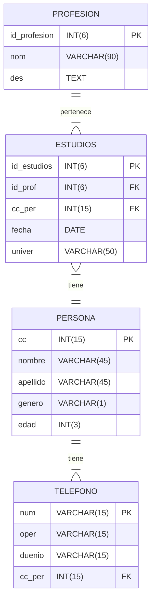

# personapp-hexa-spring-boot
Plantilla Laboratorio Arquitectura Limpia

Instalar MariaDB en puerto 3307
Instalar MongoDB en puerto 27017

Ejecutar los scripts en las dbs

el adaptador rest corre en el puerto 3000
el swagger en http://localhost:3000/swagger-ui.html

Son dos adaptadores de entrada, 2 SpringApplication diferentes

Deben configurar el lombok en sus IDEs

Pueden hacer Fork a este repo, no editar este repositorio

---

# Laboratorio 2

Implementación de  Servicio WEB en Hexagonal con Repository y Service

Stack

- JDK 11
- Spring Boot
- MongoDB y MariaDB
- REST y CLI
- Swagger 3

Realizar endpoints para el CRUD del siguiente modelo de datos

se entrega:

- URL TAG del repositorio git (Github/Gitlab/Bitbucket/etc)
    - README con la configuración, pasos para configurar ambiente, compilación y despliegue.
    - Script DDL y DML
    - Código fuente.
- Documento:
    - Portada
    - Marco conceptual
    - Diseño
    - Procedimiento
    - Conclusiones y lecciones aprendidas
    - Referencias
